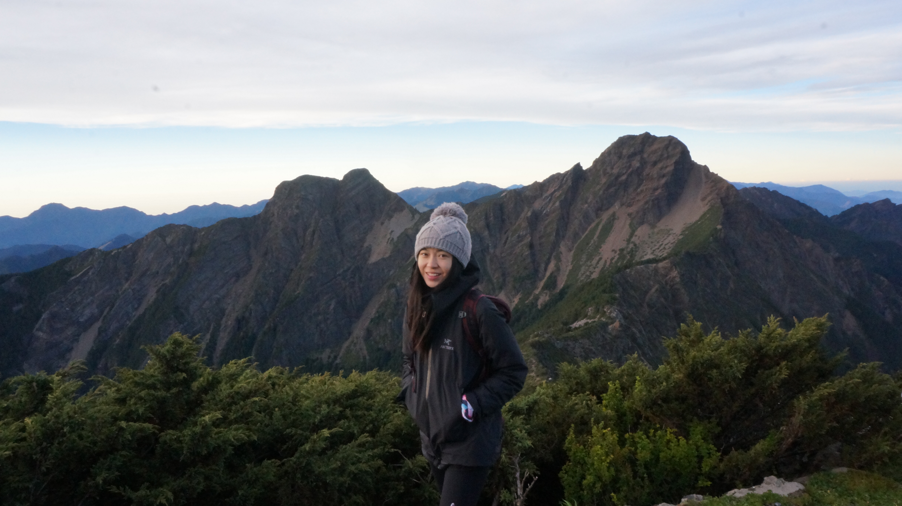

### Julie Hsieh

　　A public health research student who loves mountain climbing. As a nursing B.S graduate, I start my research about multimorbidity. Currently, I use R-language, SPSS, SAS as statistic tools for my research.

　　With a few years learning and working in public research hospital, I find being agile and state of the art research learning important. With various skills and coding statistic tools, solutions can be found in muliple ways. Fill free to drop a comment down below and discuss with me about R-language, SPSS, and SAS!  Also, dm me for a hike: juliehsiehpro@gmail.com. Peace ✌️!

